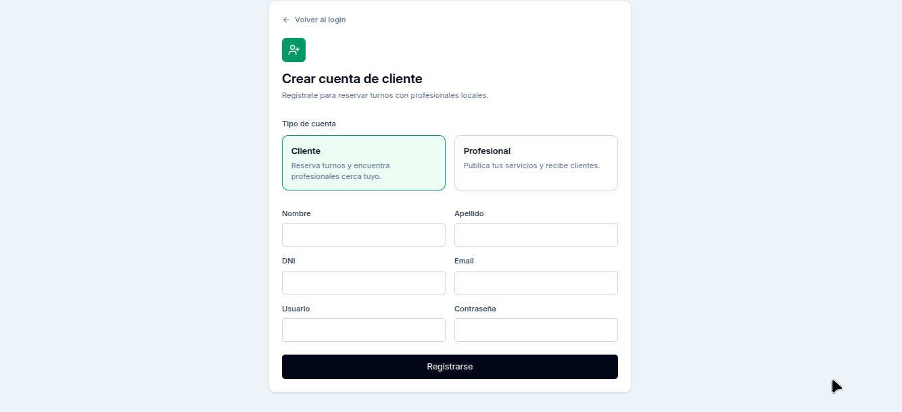
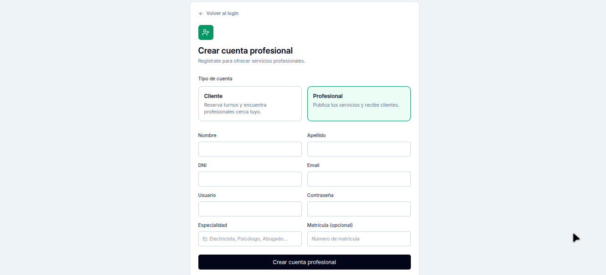
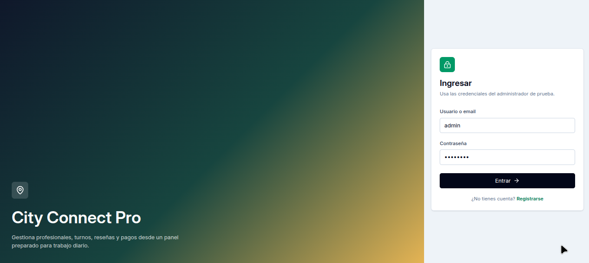
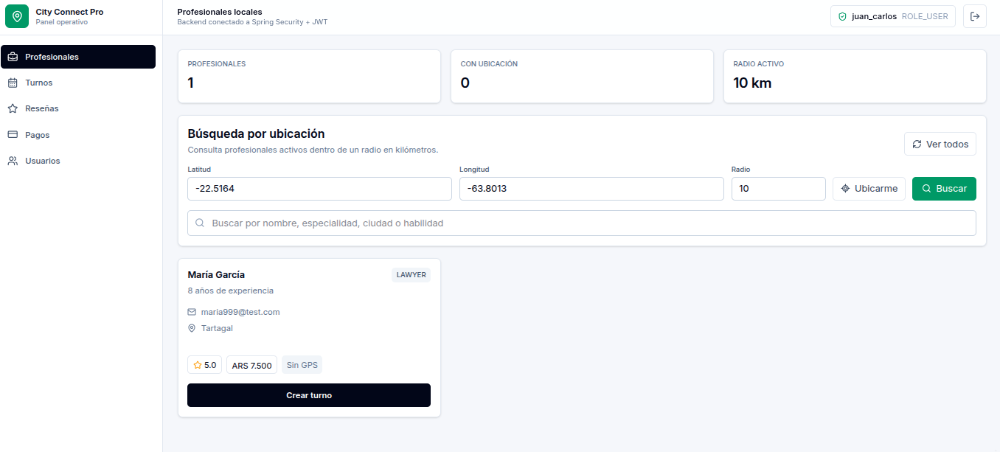
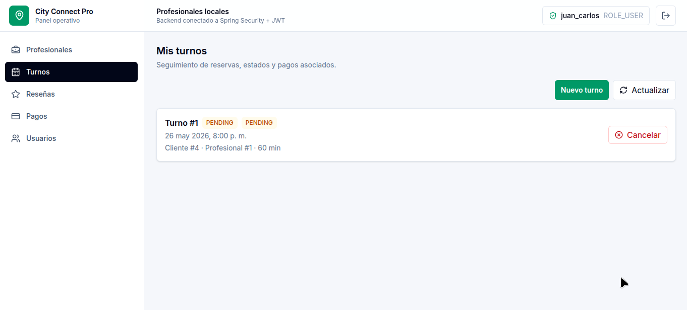
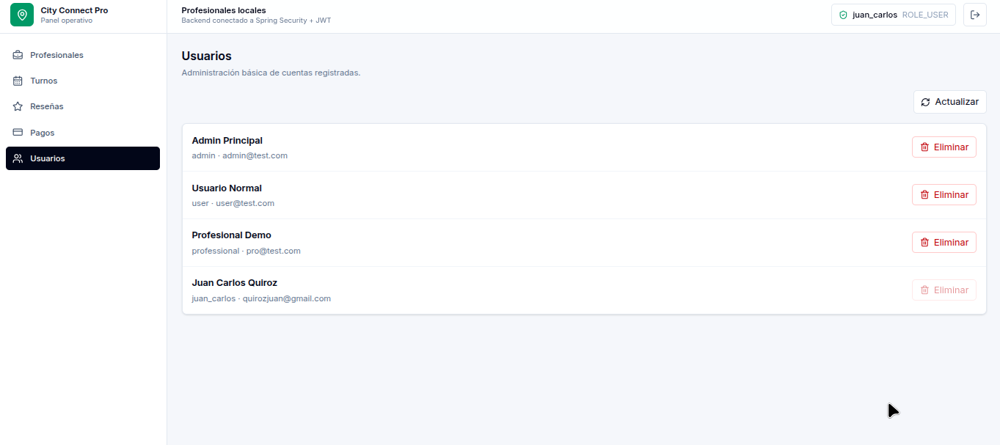
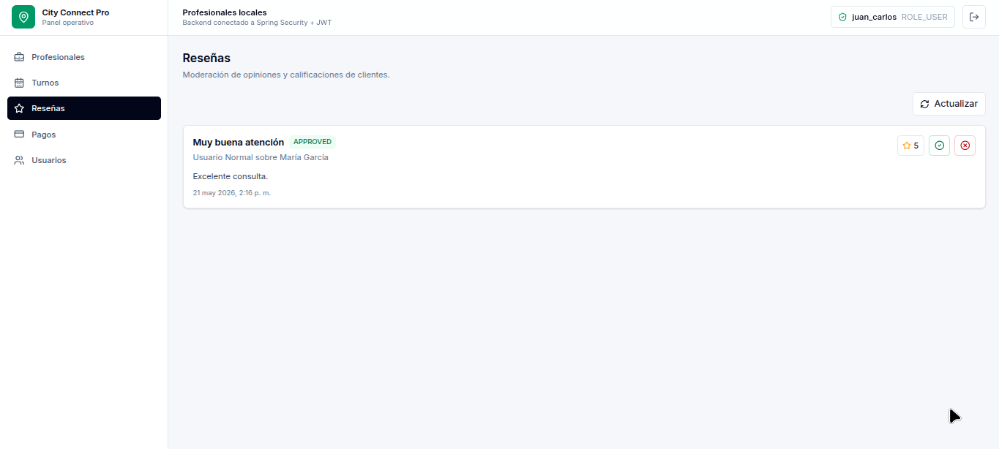

## 🌆 City Connect Pro

**City Connect Pro** es una plataforma para conectar profesionales locales (abogados, médicos, electricistas, etc.) con clientes de la ciudad. 
  Los usuarios pueden explorar servicios, hacer consultas en línea o agendar turnos.

---

## 🚀 Tecnologías Utilizadas

### 🖥️ Frontend
- React
- TypeScript
- Tailwind CSS
- Axios
- React Router

### 🛠️ Backend
- Java
- Spring Boot
- Spring Security
- JWT (JSON Web Token)
- MySQL
- JPA + Hibernate

---

## 🧩 Funcionalidades

- 🧑 Registro de profesionales
- 👥 Registro de clientes
- 🗓️ Agenda de turnos y consultas
- 🔐 Login/Registro con seguridad (JWT)
- 🗃️ Gestión de perfiles y servicios
- 📈 Vista de métricas o reportes básicos

---

# 📊 Dashboards

### Client Register

---
### Register Pro

### Login Dashboard

---

### Professional Dashboard

---

### Appointments Dashboard

---

### Users Dashboard

---

### Reviews Dashboard

🔗 Demo
👉 Ver Demo

🧑‍💻 Autor
Juan Quiroz
📍 Tartagal, Salta – Argentina
💼 Desarrollador Full Stack Java

